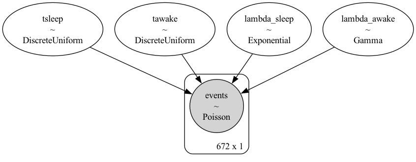
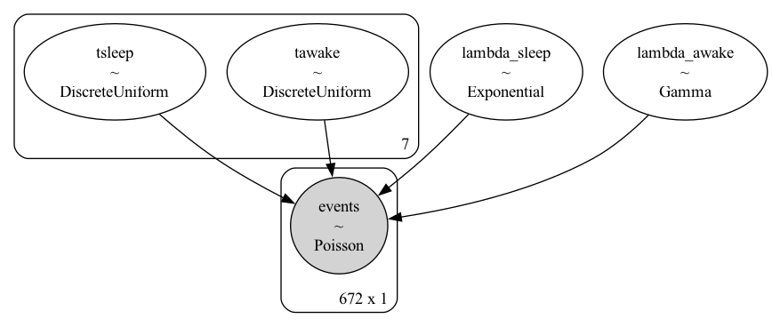
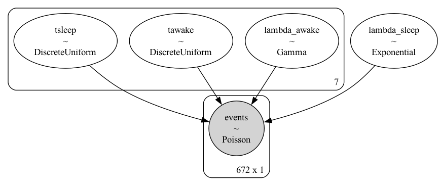
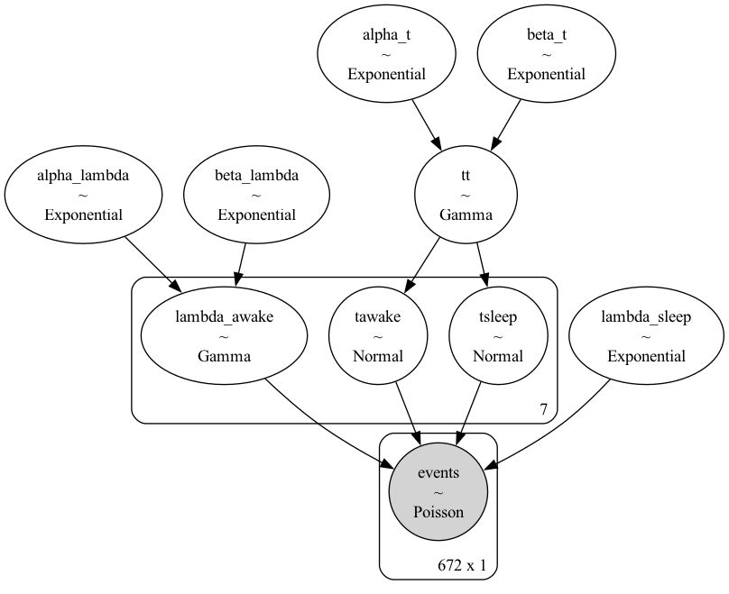

# Models Overview
A progression of Bayesian models for extracting sleep patterns from smartphone events (screen on/off). Each of the models is built on the previous one, adding more complexity and assumptions.

## General Assumptions

- User Modes: Each user is either awake or asleep.
- Phone Usage: Higher interaction rates when awake; minimal during sleep.
- Event Counts: Number of events in each time bin follows a Poisson distribution.
- Time Bins: Day divided into fixed intervals (e.g., 15-minute bins).

## Models

### Pooled-Pooled Model

Assumptions:
- Fixed Sleep and Wake Times: Same times across all days.
- Consistent Interaction Rate: Same awake interaction rate every day.

Parameters:
- Sleep time tsleep ~ DiscreteUniform(0, n_bins)
- Wake time twake ~ DiscreteUniform(0, n_bins)
- Awake rate λawake ~ Gamma(α=2.5, β=1)
- Sleep rate λsleep ~ Exponential(λ=10,000)
- Usage: When user behavior is highly consistent daily.

### Independent-Pooled Model

Assumptions:
- Variable Sleep and Wake Times: Different each day.
- Consistent Interaction Rate: Same awake interaction rate every day.

Parameters:
For each day i:
- Sleep time tsleep_i ~ DiscreteUniform(0, n_bins)
- Wake time twake_i ~ DiscreteUniform(0, n_bins)
- Awake rate λawake ~ Gamma(α=2.5, β=1)
- Sleep rate λsleep ~ Exponential(λ=10,000)
- Usage: When sleep times vary daily, but interaction rate remains consistent.


### Independent-Independent Model

Assumptions:
- Variable Sleep and Wake Times: Different each day.
- Variable Interaction Rates: Different awake rates each day.


Parameters:
For each day i:
- Sleep time tsleep_i ~ DiscreteUniform(0, n_bins)
- Wake time twake_i ~ DiscreteUniform(0, n_bins)
- Awake rate λawake_i ~ Gamma(α=2.5, β=1)
- Sleep rate λsleep ~ Exponential(λ=10,000)
- Usage: When both sleep times and interaction rates vary daily.


### Independent-Hierarchical (hyper) Model

Assumptions:
- Variable Sleep and Wake Times: Different each day.
- Hierarchical Interaction Rates: Awake rates vary daily but share common hyperparameters.

Parameters:
For each day i:
- Sleep time tsleep_i ~ DiscreteUniform(0, n_bins)
- Wake time twake_i ~ DiscreteUniform(0, n_bins)
- Hyperparameters:
    - αλ ~ Exponential(λ=1)
    - βλ ~ Exponential(λ=1)
- Awake rate λawake_i ~ Gamma(α=αλ, β=βλ)
- Sleep rate λsleep ~ Exponential(λ=10,000)
- Usage: When interaction rates vary daily but are drawn from a common distribution.


### Hierarchical-Hierarchical Model

Assumptions:
- Hierarchical Sleep and Wake Times: Times vary daily, drawn from user-specific distributions.
- Hierarchical Interaction Rates: Awake rates vary daily, drawn from common hyperparameters.

Parameters:
- Sleep time hyperparameters:
    - μsleep ~ Normal(mean, variance)
    - σsleep ~ Exponential(λ=1)
- Wake time hyperparameters:
    - μwake ~ Normal(mean, variance)
    - σwake ~ Exponential(λ=1)
- For each day i:
    - Sleep time tsleep_i ~ Normal(μ=μsleep, σ=σsleep)
    - Wake time twake_i ~ Normal(μ=μwake, σ=σwake)
- Interaction rate hyperparameters:
    - αλ ~ Exponential(λ=1)
    - βλ ~ Exponential(λ=1)
- Awake rate λawake_i ~ Gamma(α=αλ, β=βλ)
- Usage: When both sleep times and interaction rates vary daily and are drawn from user-specific distributions.


## Configuration Parameters
The package uses a configuration file config.py to manage parameters for data generation and modeling.

```python
CONFIG = {
    'n_users': 126,          # Number of users
    'n_days': 7,             # Number of days per user
    'n_bins': 96,            # Number of time bins in a day (15-minute intervals)
    'avg_screen_ons': 76,    # Average screen-on activations per user per day
    'ncores': 7,             # Number of CPU cores to use
    # Add other configuration parameters as needed
}
```
